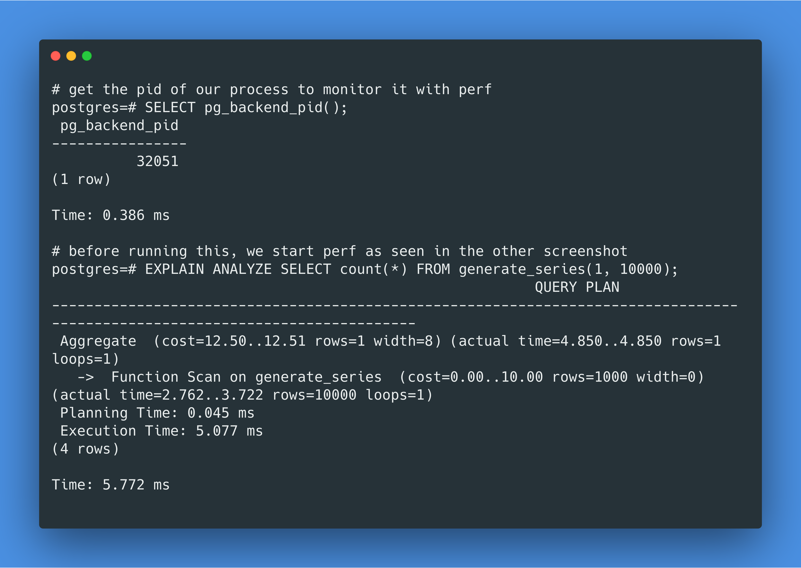
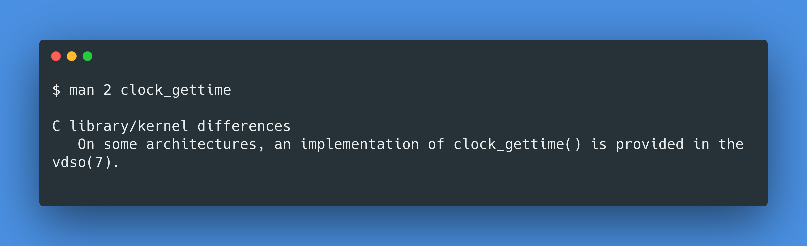

theme: Plain Jane

1) Are you using #postgres via #docker for mac?

Have you ever noticed `EXPLAIN ANALYZE` slowing down your queries by like 60x?

Let's dig into some #postgres and #linux internals to figure out what's going on!

---

2) First we need some understanding of how `EXPLAIN ANALYZE` works.

Looking through the PostgreSQL code, it basically boils down to:

    start = clock_gettime()
    row = node.nextRow()
    node.time += clock_gettime() - start
    return row

---

3) So at this point we could conclude that PostgreSQL is making 20K system calls to `clock_gettime` here, and that is slow on docker for mac for some reason.

But that's kinda lame, so let's dig deeper.

---

4) First, let's establish if `clock_gettime` is really the culprit by running `pg_test_timing` that comes with PostgreSQL inside of a docker container.

Holy latency batman, at 6853 ns per call, our 20K calls will take 136 ms, explaining most of the overhead we're seeing.

---

5) But what kind of latency is reasonable to expect? `pg_test_timing` on my macOS host machine shows 65 ns which is about 100x faster.

Docker for mac works by launching a linux vm in the background. Maybe the issue is caused by "vm overhead"?

https://github.com/moby/hyperkit

---

6) Let's compare VM overhead with a VirtualBox running Ubuntu 18.04.

Most `EXPLAIN ANALYZE` overhead is gone, and `clock_gettime` latency of 33ns is 2x better than on our host machine .  

That doesn't make sense, or does it? 😮

 

---

6) Time for a sanity check. Are we really calling the `clock_gettime` call 20K for our query above? Let's do some syscall counting using perf:

    sudo perf stat -e 'syscalls:sys_enter_clock_*' -p <backend_pid>

This tells us that 0 `clock_gettime` calls were made. Whaaat?

 

---

7) How about `pg_test_timing`, surely that will make some syscalls?

    sudo perf stat -e 'syscalls:sys_enter_clock_*' $(which pg_test_timing)

Nope, still no syscalls. Computer stuff is hard 😩

---

8) It's time to get out some bigger guns. Let's disassemble InstrStartNode using gdb to check if we're actually making a syscall.

    callq  0xafc10 <clock_gettime@plt>

The `@plt` stands for Procedure Linkage Table, which means we're calling into libc!

---

9) Let's verify this real quick with some dynamic tracing.

    sudo perf probe -x /lib/x86_64-linux-gnu/libc.so.6 'clock_gettime'
    sudo perf stat -e 'probe_libc:clock_gettime' -p <backend_pid>

20016 calls to libc's clock_gettime. We're also seeing some tracing overhead now.

 

---

10) After this I continued stumbling forward with gdb and reading the libc source until I found references to VDSO which is an optimization that avoids syscalls.

... or you could be smart and just RTFM instead:

    man 2 clock_gettime
    man 7 vdso

 

---

11) So let's go back to our original problem. Why is `clock_gettime` slow on docker for mac?

It seems that it's time drift issues that can change the clocksource.

    docker run --privileged -it postgres dmesg | egrep '(tsc|hpet)'

https://benchling.engineering/analyzing-performance-analysis-performance-56cb2e212629

---

12) And according to the maintainer for Linux vDSO, the hpet clocksource is so aweful that he disabled vDSO HPET support entirely.

https://news.ycombinator.com/item?id=16925602

---

13) So the root cause seems to be the time sync mechanism used by docker for mac which has been redone in 18.05.

https://www.docker.com/blog/addressing-time-drift-in-docker-desktop-for-mac/

---

14) However, it still seems to be buggy, especially when sleep is involved.

Unfortunately Github issues for it don't seem to be getting much attention, despite this bug impacting a large range of applications. E.g. here is a report of PHP requests being slowed down by 3x:

https://github.com/docker/for-mac/issues/2747

---

15) And once you start to google around a little more, you realize that clocksource related issues disabling VDSO has also heavily impacted cloud vendors such as AWS in the past.

https://blog.packagecloud.io/eng/2017/03/08/system-calls-are-much-slower-on-ec2/

---

16) So what can you do?

One workaround seems to be to restart docker for mac, but usually it's just a matter of time before the clocksource issue will hit you again.

In my team at work we've agreed to always use PostgreSQL on macOS directly when doing performance related work.

---

17) Either way, the important takeaway is that our modern stacks are incredibly complex and fragile.

As an application developer, you will probably not be able to master this complexity. But you will be asked to explain why your stuff is slow.

---

18) So invest in your debugging skills.

Learn enough C to be able to read it, enough gdb to set some breakpoints, and enough perf tools to trace syscalls and function calls.

And soon enough, even the most daunting PostgreSQL performance mysteries will reveal themselves.

---

19) If you made it so far and love working with #postgresql and/or #golang, my team at Apple is hiring in #shanghai.

We support relocation, and my DMs are open for any questions!

https://jobs.apple.com/en-us/details/200122427/backend-software-developer-manufacturing-design-systems
